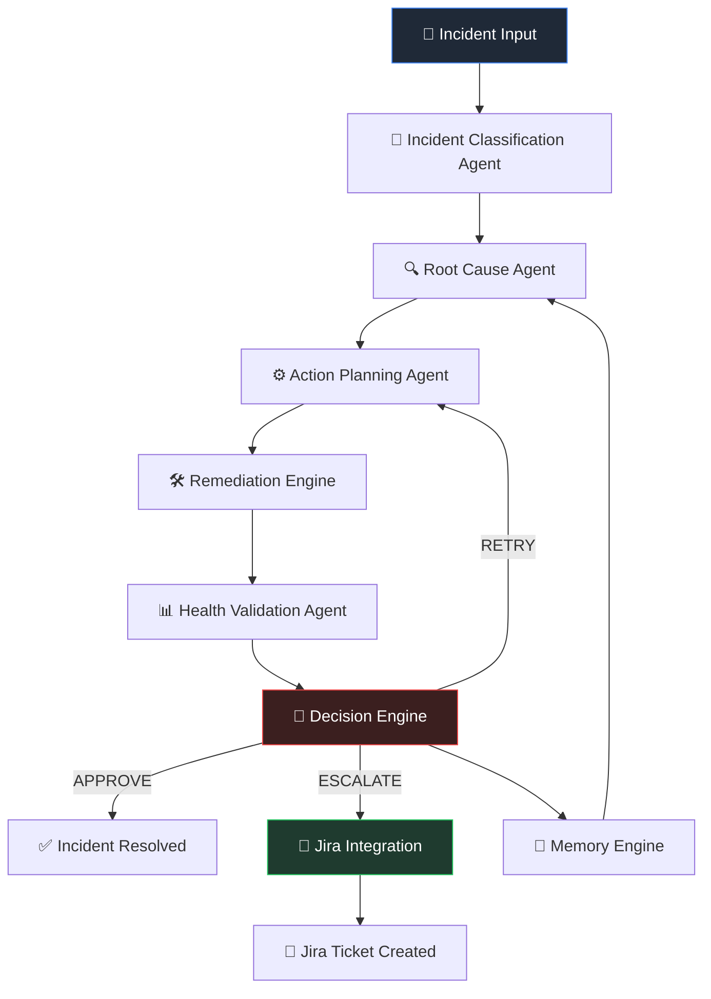
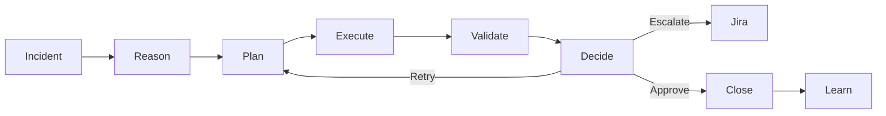
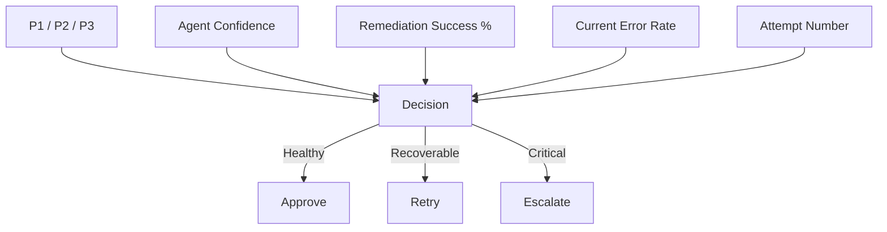
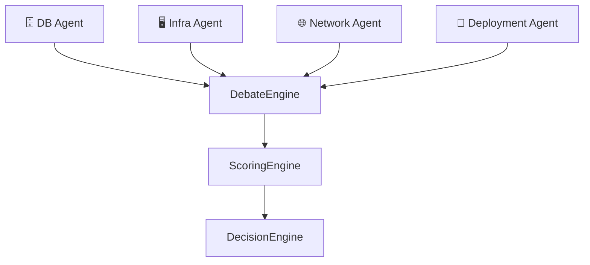

---

# 🏗️ System Architecture

```mermaid
flowchart TD

    A[🚨 Incident Input] --> B[🧠 Incident Classification Agent]
    B --> C[🔍 Root Cause Agent]
    C --> D[⚙️ Action Planning Agent]
    D --> E[🛠 Remediation Engine]
    E --> F[📊 Health Validation Agent]
    F --> G[🧠 Decision Engine]

    G -->|APPROVE| H[✅ Incident Resolved]
    G -->|RETRY| D
    G -->|ESCALATE| I[📌 Jira Integration]

    I --> J[🎫 Jira Ticket Created]

    G --> K[💾 Memory Engine]
    K --> C

    style A fill:#1f2937,stroke:#3b82f6,color:#fff
    style G fill:#3b1f1f,stroke:#ef4444,color:#fff
    style I fill:#1f3b2f,stroke:#22c55e,color:#fff
```

---

# 🔄 Autonomous Decision Loop

```mermaid
flowchart LR

    Incident --> Reason
    Reason --> Plan
    Plan --> Execute
    Execute --> Validate
    Validate --> Decide
    Decide -->|Retry| Plan
    Decide -->|Escalate| Jira
    Decide -->|Approve| Close
    Close --> Learn
```

---

# 🧠 Governance & Escalation Logic

```mermaid
flowchart TD

    Severity[P1 / P2 / P3] --> Decision
    Confidence[Agent Confidence] --> Decision
    SuccessRate[Remediation Success %] --> Decision
    ErrorRate[Current Error Rate] --> Decision
    Attempt[Attempt Number] --> Decision

    Decision -->|Healthy| Approve
    Decision -->|Recoverable| Retry
    Decision -->|Critical| Escalate
```

---

# 🏢 Enterprise Evolution (Planned)

```mermaid
flowchart TD

    DB[🗄 DB Agent] --> DebateEngine
    Infra[🖥 Infra Agent] --> DebateEngine
    Network[🌐 Network Agent] --> DebateEngine
    Deploy[🚀 Deployment Agent] --> DebateEngine

    DebateEngine --> ScoringEngine
    ScoringEngine --> DecisionEngine
```

---

